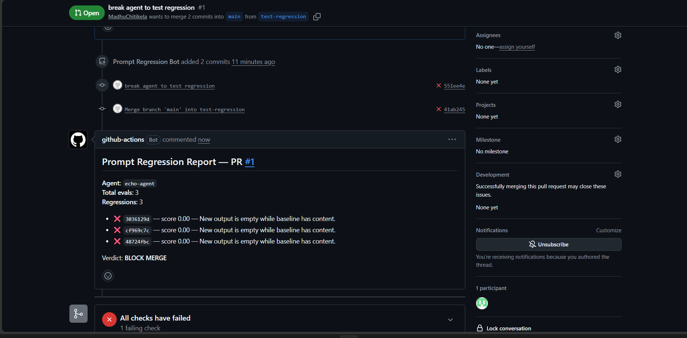

# Prompt Regression MCP Server

A FastMCP server that traces agent runs, replays production failures as tests,
and blocks PRs when prompt changes cause regressions.

## Why

Every agentic team needs a harness that proves agents hold up — not just the
happy path. This is that harness, exposed as MCP tools.

## Architecture

```
Agent → tracer.py → SQLite traces
                        ↓
       FastMCP tools: record, query, replay, diff, promote, grade, report
                        ↓
              GitHub Actions CI on every PR
                        ↓
              PR comment: BLOCK MERGE or PASS
```

## MCP Tools

| Tool | Purpose |
|------|---------|
| `record_trace` | Persist an agent run with inputs, outputs, tool calls, latency, and cost |
| `query_traces` | Search historical traces for an agent with filtering |
| `get_trace` | Fetch full trace data by ID |
| `replay_trace` | Re-run input against current agent version |
| `diff_traces` | Show what changed between two trace runs |
| `promote_to_eval` | Add a failure or baseline trace to the eval suite |
| `grade_regression` | LLM-as-judge comparison vs. baseline on promoted evals |
| `report_pr_comment` | Format and write PR markdown summary for CI |

## Quick Start

```bash
git clone https://github.com/YOU/prompt-regression-mcp
cd prompt-regression-mcp
python -m venv .venv
# Windows:
.venv\Scripts\activate
# Linux/macOS:
source .venv/bin/activate

pip install -r requirements.txt
cp .env.example .env
# Add your GROQ_API_KEY in .env
python -m app.main
```

MCP HTTP endpoint: `http://localhost:8000/mcp/`

## Real Regression Caught in CI



> **Prompt Regression Report — PR #1**
> - ❌ 3 regressions — Agent output empty while baseline has content
> - **BLOCK MERGE**

## Running Tests

```bash
pytest tests/ -v
```

## CI Integration

The included GitHub Actions workflow (`.github/workflows/regression.yml`) runs on pull requests:
1. Executes `ci/regression_check.py` against promoted test cases.
2. Invokes LLM-as-judge (Groq Llama-3.3-70B) to detect output regressions.
3. Automatically posts a summary markdown comment to the PR.
4. Fails the build and blocks merging if regressions are detected.

## License

MIT
